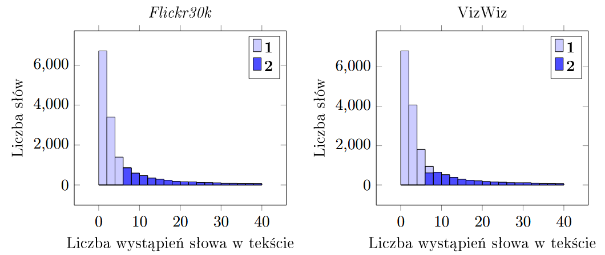
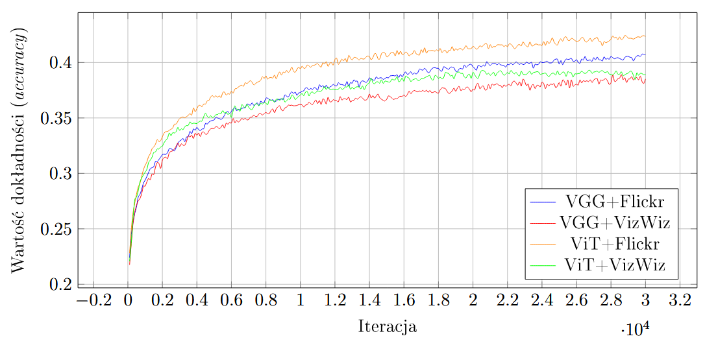
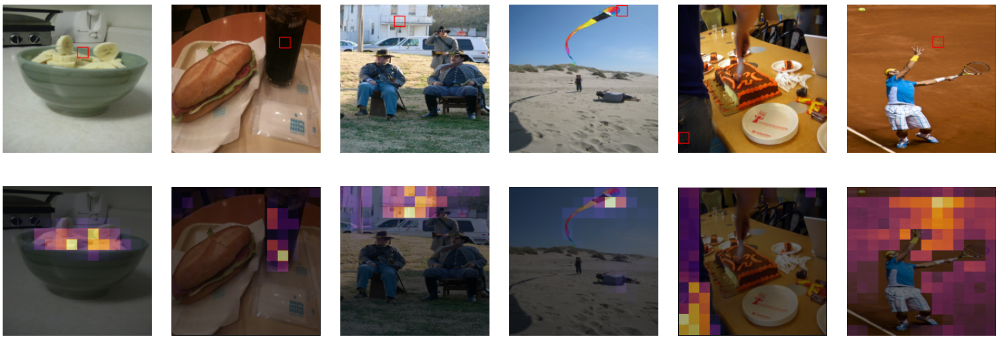
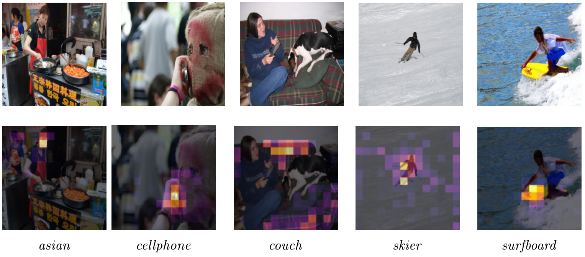

# Image captioning
## Description

This project was created as an implementational part of my Bachelor's thesis: "Generating image descriptions using deep neural networks".

## Goals of the project
The main goals of the project were:
- implementing transformer architecture block by block, without using modules provided by the PyTorch library,
- assessing the performance of the model using different feature extractors: pretrained CNN or Visual Transformer,
- comparing the quality of the descriptions generated by models trained on different datasets: Flickr8k, Flickr30k, VizWiz,
- comparing greedy and beam-search approach in generating single image caption,
- estimating the effect of the skewedness of the dataset on the word predictions,
- explaining the cause of predictions by plotting heatmaps of self- and cross-attention blocks.

## Implementation

### Feature extraction

Two different approach where tested: CNN (VGG 19) and Visual Transformer's encoder. For both scenarios the pretrained parameters were used and "frozen" from gradient updates.

### Tokenization

The captions from the datasets were normalized and tokenized by word. After that we selected top 6000 most frequent words. Below there is an illustration depicting the number of words existing in the datasets (Y-axis) versus their frequency (X-axis). The more occurences in the dataset, the more to the left. The state before reduction is shown by the histogram labelled as **1** and after reduction histogram **2**.

### The model

The PyTorch Lightning library was used for easier implementation of callbacks and training loop.

## Results

### Training procedure

Below you can find a graph of accuracy measured at different moments of training procedure for all conducted variants of the experiments.

### Self attention
Self attention is the ability of the model to make elements of the input attend to each other (base their processing on internal relations between the input elements). The self attention block exists both in the encoder (where image features are processed) and decoder (where caption is processed). Below is the illustration of how an image attends to itself.

### Cross attention
Cross attention is used to attend between elements of the encoder's output and decoder's internal processing. In our case it is the relation between the elements of the image and the next words of the image description. Below there is an image depicting this relation.

### Caption generation

The text is generated by predicting one token at the time. The generation starts with providing on the input of the decoder the `[start]` token and an image to the feature extractor (later feeding the encoder input). The model, based on those two inputs provides scores for each word in the vocabulary. Further generation is done through the beam search.  

In the beam search (depicted in the figure below or [here](media/beam_search_graph.pdf)) each branch represents unravelling of the top-3 scoring predictions. Those predictions are appended to the previous decoder's input and the process continues. The generation ends on either reaching limit length or predicting the end-of-sequence token `[end]`.

| Node number  | Caption                                         | Probability |
|--------------|-------------------------------------------------|-------------|
| 0            | [start]                                         | 1.00e+00    |
| 1            | [start] a                                       | 6.47e-01    |
| 2            | [start] the                                     | 9.91e-02    |
| 3            | [start] two                                     | 6.03e-02    |
| 4            | [start] a black                                 | 2.60e-01    |
| 5            | [start] a dog                                   | 1.45e-01    |
| 6            | [start] a brown                                 | 1.16e-01    |
| 7            | [start] the   black                             | 3.26e-02    |
| ...          |                                                 |             |
| 51           | [start] a black dog jumps over a barrier        | 3.93e-03    |
| 52           | [start] a dog   jumps over a hurdle [end]       | 1.09e-02    |
| 53           | [start] a dog jumps over a hurdle in            | 2.53e-03    |
| 54           | [start] a dog   jumps over a hurdle while       | 2.00e-03    |
| 55           | [start] a brown dog jumps over a hurdle         | 1.24e-02    |
| 56           | [start] a brown   dog jumps over a fence        | 3.94e-03    |
| 57           | [start] a brown dog jumps over a barrier        | 1.94e-03    |
| 58           | [start] a black   dog jumps over a hurdle [end] | 1.02e-02    |
| 59           | [start] a black dog jumps over a hurdle in      | 3.01e-03    |
| 60           | [start] a brown   dog jumps over a hurdle [end] | 5.55e-03    |
| 61           | [start] a brown dog jumps over a hurdle in      | 1.58e-03    |