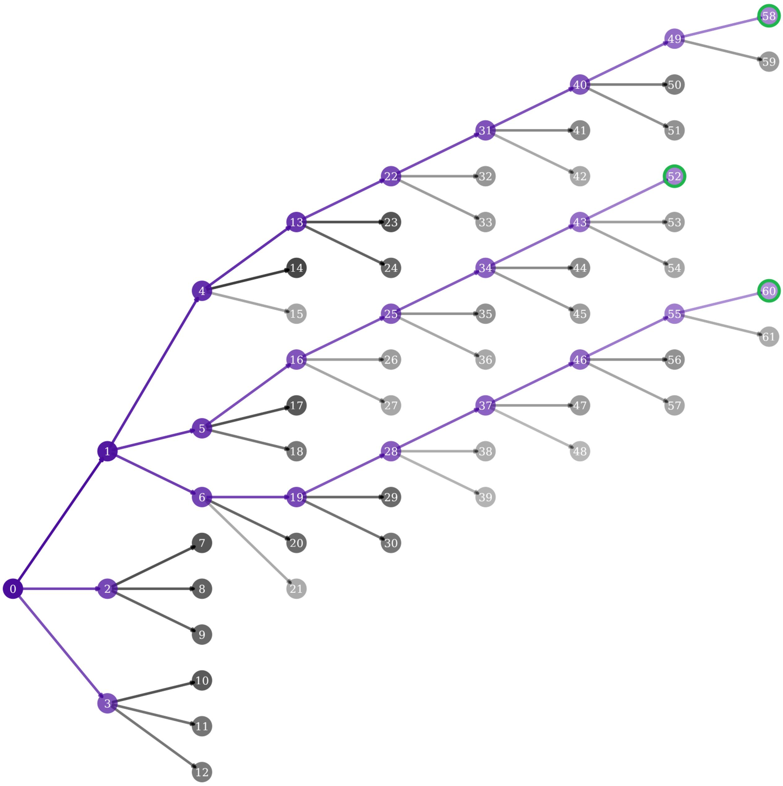

# Image captioning
## Description

This project was created as an implementational part of my Bachelor's thesis: "Generating image descriptions using deep neural networks".

## Goals of the project
The main goals of the project were:
- implementing transformer architecture block by block, without using modules provided by the PyTorch library,
- assessing the performance of the model using different feature extractors: pretrained CNN or Visual Transformer,
- comparing the quality of the descriptions generated by models trained on different datasets: Flickr8k, Flickr30k, VizWiz,
- comparing greedy and beam-search approach in generating single image caption,
- estimating the effect of the skewedness of the dataset on the word predictions,
- explaining the cause of predictions by plotting heatmaps of self- and cross-attention blocks.

## Implementation

## Results

### Caption generation

The text is generated by predicting one token at the time. The generation starts with providing on the input of the decoder the `[start]` token and an image to the feature extractor (later feeding the encoder input). The model, based on those two inputs provides scores for each word in the vocabulary. Further generation is done through the beam search.  

In the beam search (depicted in the figure below or [here](media/beam_search_graph.pdf)) each branch represents unravelling of top-3 scoring predictions. Those predictions are appended to the previous decoder's input and the process continues. The generation ends on either reaching limit length or predicting end of sequence token `[end]`.

| Nb  | Caption                                         | Probability |
|-----|-------------------------------------------------|-------------|
| 0   | [start]                                         | 1.00e+00    |
| 1   | [start] a                                       | 6.47e-01    |
| 2   | [start] the                                     | 9.91e-02    |
| 3   | [start] two                                     | 6.03e-02    |
| 4   | [start] a black                                 | 2.60e-01    |
| 5   | [start] a dog                                   | 1.45e-01    |
| 6   | [start] a brown                                 | 1.16e-01    |
| 7   | [start] the   black                             | 3.26e-02    |
| ... |                                                 |             |
| 51  | [start] a black dog jumps over a barrier        | 3.93e-03    |
| 52  | [start] a dog   jumps over a hurdle [end]       | 1.09e-02    |
| 53  | [start] a dog jumps over a hurdle in            | 2.53e-03    |
| 54  | [start] a dog   jumps over a hurdle while       | 2.00e-03    |
| 55  | [start] a brown dog jumps over a hurdle         | 1.24e-02    |
| 56  | [start] a brown   dog jumps over a fence        | 3.94e-03    |
| 57  | [start] a brown dog jumps over a barrier        | 1.94e-03    |
| 58  | [start] a black   dog jumps over a hurdle [end] | 1.02e-02    |
| 59  | [start] a black dog jumps over a hurdle in      | 3.01e-03    |
| 60  | [start] a brown   dog jumps over a hurdle [end] | 5.55e-03    |
| 61  | [start] a brown dog jumps over a hurdle in      | 1.58e-03    |